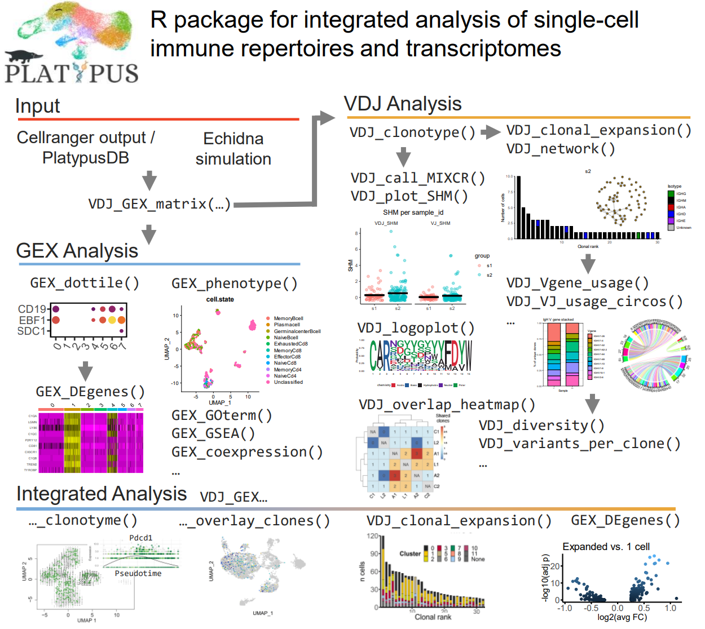

<!-- README.md is generated from README.Rmd. Please edit that file -->


## [==&gt; Platypus and PlatypusDB homepage](https://alexyermanos.github.io/Platypus/index.html "Platypus and PlatypusDB homepage")

# Platypus

Platypus is an R toolkit designed to facilitate the data analysis of
single-cell immune repertoire sequencing experiments. The manuscript
corresponding to Platypus v2 can be found here at Yermanos et al NARGAB
2021 <https://doi.org/10.1093/nargab/lqab023> and the updated manuscript concerning the v3 Platypus ecosystem can be found here: <https://www.biorxiv.org/content/10.1101/2022.09.28.509709v1>


# Platypus Quickstart v3.6.0 (https://cran.r-project.org/web/packages/Platypus/index.html)

We have reworked the function that creates the core object of Platypus. We now suggest users to create a VGM object by first using the VDJ_build function found within the current CRAN version of the Package. This function can be run by suppling a list of directories to the VDJ output from 10x Genomics

VDJ.input <- list()
VDJ.input[[1]] <- “~/Downloads/VDJ/s1/“
VDJ.input[[1]] <- “~/Downloads/VDJ/s2/“
VGM[[1]] <- VDJ_build(VDJ.input)

As in the older version of platypus, the second list element in the VGM object can hold a Seurat object. We recommend that users run their own single-cell sequencing analysis to determine important parameters that are specific to their dataset (number of principal components, cut offs for mitochondrial and read counts, etc). We also suggest to remove the B and T cell receptor genes from the gene expression matrix, as these genes will cause clonal memberships to influence transcriptional clustering, as they are often in the set of variable features. 

Following the creation of a Seurat object, the object can be supplied to the VGM. For integration of VDJ and GEX information, the Seurat object samples should be in the same order as the VDJ directories supplied. 

VGM[[2]] <- my_seurat_object

There is a function that can integrate features from GEX and VDJ in platypus.

VGM <- VGM_integrate(VGM) 

This will now bring features from VDJ to GEX and vice versa (VGM[[1]] and VGM[[2]]). This VGM object can be used for downstream analyses in the Platypus package, in addition to the pipelines present in the AntibodyForests package (https://cran.r-project.org/web//packages/AntibodyForests/index.html). We have highlighted some of the downstream functions and use cases for the VGM object within the Platypus ecosystem. Functions primarily working on repertoire data start with "VDJ_" whereas functions focusing on commonly used gene expression analyses start with "GEX_". 

# Phylogenetics
We have created an entire pipeline to analysis B cell evolution within the context of immune repertoires. A more detailed vignette can be found here (https://cran.r-project.org/web//packages/AntibodyForests/index.html). These functions include various methods to construct antibody lineages (in the form of phylogenetic networks), can integrate bulk and single-cell immune repertoire sequencing data, analyze and compare lineages within and across individuals, and furthermore integrate protein language models and strutural models with B cell evolution.  

# Clonal Expansion
VDJ_clonal_expansion <br/>
VDJ_clonal_barplot <br/>
VDJ_clonal_donut 

# Germline Gene usage
VDJ_Vgene_usage
VDJ_Vgene_usage_barplot
VDJ_Vgene_usage_stacked_barplot
VDJ_circos
VDJ_VJ_usage_circos
VDJ_alpha_beta_Vgene_circos

# Clonal dynamics and diversity
VDJ_abundances
VDJ_diversity
VDJ_dynamics
VDJ_kmers
VDJ_ordination
VDJ_rarefaction
VDJ_logoplot_vector

# Somatic Hypermutation
VDJ_plot_SHM
VDJ_variants_per_clone

# Clonotyping 
VDJ_clonotype
VDJ_call_enclone
VDJ_clonotype_v3_w_enclone

# Clonal Convergence and similarity Networks
VDJ_overlap_heatmap
VDJ_public
VDJ_network

# Gene Expression Analysis
We have included many wrapper functions to investigate gene expression profiles. This often involves suing the Seurat package but we have included other analyses such as ports to gene set enrichment analysis (GSEA). 
GEX_cluster_genes_heatmap
GEX_cluster_membership
GEX_coexpression_coefficient
GEX_DEgenes
GEX_dottile_plot
GEX_gene_visualization
GEX_heatmap
GEX_proportions_barplot
GEX_volcano
GEX_GSEA

# Integrating gene expression with repertoire information
VDJ_GEX_overlay_clones
VDJ_GEX_clonotype_clusters_circos


# Ongoing updates in the Platypus pipeline (v3)

Due to the recent changes of the default clonotyping strategy in Cellranger 
(version 5 and version 6) and annotation of the framework and CDR regions 
(version 7) we have rebuild Platypus to revolve around the VDJ\_build function. 
This function creates a dataframe of the repertoire data. The function 
VGM_build integrates the repertoire and transcriptome information (Seurat object) 
and will serve as the input to all secondary functions in  future iterations of 
the package. The advantage of this is having all repertoire and transcriptome 
information at a per-cell level.

Furthermore we developed PlatypusDB, a publicly available database that
facilitates the download, integration, and analysis of hundred thousands
of single-cells that contain GEX information, VDJ information or both.
With a single line of code, PlatypusDB allows users to either download
and explore available datasets or integrate existing experiments with
their own datasets. Collectively, PlatypusDB serves as a database for
the scientific community interested in exploration of single cell immune
repertoire sequencing experiments from mouse and human.

Stay tuned for updates 




# System requirements

Platypus has been successfully installed on MacOS X (v10.14.6) and
Windows 10 Pro (v1909), and used on R versions 4.4.0, 4.0.0 and 3.6.1

# Installation

Platypus can easily be installed from CRAN or Github. As changes and bugfixes are made regularly, the Github version may be more recent.

Please scroll down for instructions on how to install the necessary dependencies.

``` r

### Removing any previous versions of the package
# First we will ensure that there is no previous version installed locally
#detach("package:Platypus", unload=TRUE)
#remove.packages("Platypus")

### Downloading and installing Platypus from CRAN

install.packages("Platypus")

### Downloading and installing Platypus from Github

# First we need to download the most recent version from the master branch at https://github.com/alexyermanos/Platypus we can install the package using the following command.
# WARNING: This needs to be replaced with your own directory where the downloaded package is found
# For MacOS users it may look like this
install.packages("~/Downloads/Platypus_3.6.0.tar.gz", repos = NULL, type="source")
# For windows it will likely look something like this.
# WARNING: You will need to replace 'YourPCName' with your user name for the windows account in the directory.
install.packages("C:/Users/YourPCName/Downloads/Platypus_3.6.0.tar.gz", repos = NULL, type="source")

# The individual R functions can additionally be found on the github in the Functions branch. Within this branch, there is a folder "R" which contains the individual functions. This can similarly be downloaded and loaded into the R environment incase not all functions are desired. Similarly, these functions are actively updated and may include more features than the in current CRAN version.

```

Platypus uses a number of different R packages, some of which need prior
installation. These can be installed either from CRAN, Bioconductor:

## CRAN

Code to install the packages from CRAN:

``` r
#Essential packages
install.packages("tidyverse")
install.packages("Seurat")
install.packages("utils")

#Optional packages needed for some individual functions
install.packages("ape")
install.packages("circlize")
install.packages("do")
install.packages("dplyr")
install.packages("ggplot2")
install.packages("ggseqlogo")
install.packages("igraph")
install.packages("jsonlite")
install.packages("phytools")
install.packages("reshape2")
install.packages("seqinr")
install.packages("stringdist")
```

## GitHub

### Harmony (but not required if not using the Harmony integration method)

Code for installing harmony:

``` r
install.packages("devtools")
library(devtools)
install_github("immunogenomics/harmony")
```

\#\#Bioconductor Code for installing the packages from Bioconductor:

``` r
if (!requireNamespace("BiocManager", quietly = TRUE))
    install.packages("BiocManager")

BiocManager::install("Biostrings")
BiocManager::install("org.Mm.eg.db")
BiocManager::install("edgeR")
BiocManager::install("fgsea")
BiocManager::install("msa")
BiocManager::install("ggtree")
```

Please post any questions or issues in the respecitve github section:
<https://github.com/alexyermanos/Platypus/issues> Please reach out to us
with any questions or if you would like to contribute.
